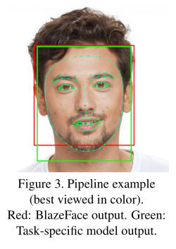
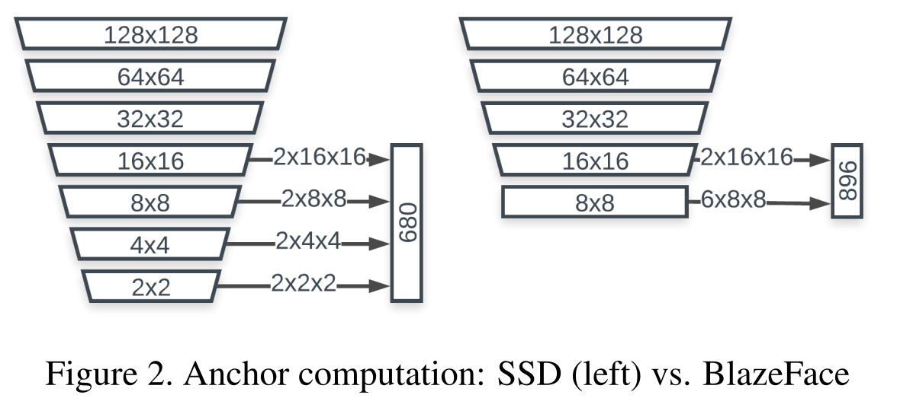

# Face Detection

## BlazeFace

- Google uses it as a face detector in [MediaPipe Studio](https://mediapipe-studio.webapps.google.com/studio/demo/face_detector)
- [Paper](./papers/BlazeFace:%20Sub-millisecond%20Neural%20Face%20Detection%20on%20Mobile%20GPUs.pdf)
- Characteristics:
  - Based on **SSD architecture** - predefined anchor boxes, but less than in SSD (Due to limited variance in human computing smaller feature maps is redundant)
  
  -  **depthwise convolutions** with kernels 5x5 - decreasing the total amount of bottlenecks required to reach a particular receptive field size, thus reducing the number of parameters and computations
  - input image size: 128x128
  - model size: 224 KB
  - outputs (17 values) for each anchor box:
    - bounding box: `ymin`, `xmin`, `ymax`, `xmax` (all normalized to [0, 1])
    - facial landmarks: `right_eye_x`, `right_eye_y`, `left_eye_x`, `left_eye_y`, `nose_x`, `nose_y`, `mouth_x`, `mouth_y`, `right_ear_x`, `right_ear_y`, `left_ear_x`, `left_ear_y`
    - number of anchor boxes: 896
- Inference details:
  1. Image size should be 128x128 with values ranging from -1 to 1
  2. Passing X through the network will result in confidence scores for each class and offsets for the anchor box. All that for each anchor box.
  3. Finding boxes for predefined anchor boxes
  4. Weighted Non-maximum suppression - *"achieves stabler, smoother tie resolution between overlapping predictions. (...) It incurs virtually no additional cost to the original NMS algorithm. "*

## YOLO

## Additional Resources
- [R CNNs, SSDs, and YOLO](https://www.youtube.com/watch?v=30qEZ8d2osg)
- [SSD](https://www.youtube.com/watch?v=F-irLP2k3Dk&t=372s)
- [BlazeFace pytorch implementation](https://github.com/hollance/BlazeFace-PyTorch/blob/master/blazeface.py)
- [SSD Anchor calculator](https://github.com/hollance/BlazeFace-PyTorch/blob/master/Anchors.ipynb)
- [YOLOv5-face-landmarks-cv2 implementation](https://github.com/hpc203/yolov5-face-landmarks-opencv-v2/blob/main/main.py)
