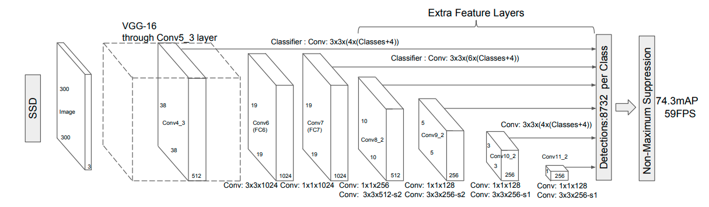

# Face Detection

## BlazeFace

- Google uses it as a face detector in [MediaPipe Studio](https://mediapipe-studio.webapps.google.com/studio/demo/face_detector)
- [Paper](./papers/BlazeFace%20Sub-millisecond%20Neural%20Face%20Detection%20on%20Mobile%20GPUs.pdf)
- Characteristics:
  - input image size: 128x128
  - model size: 224 KB
  - outputs (17 values):
    - bounding box: `ymin`, `xmin`, `ymax`, `xmax` (all normalized to [0, 1])
    - facial landmarks: `right_eye_x`, `right_eye_y`, `left_eye_x`, `left_eye_y`, `nose_x`, `nose_y`, `mouth_x`, `mouth_y`, `right_ear_x`, `right_ear_y`, `left_ear_x`, `left_ear_y`
  - number of anchor boxes: 896
  - Based on **SSD architecture** - predefined anchor boxes, but less than in SSD (Due to limited variance in human computing smaller feature maps is redundant)

  
  
  

  -  **depthwise convolutions** with kernels 5x5 - decreasing the total amount of bottlenecks required to reach a particular receptive field size, thus reducing the number of parameters and computations

- Inference details:
  1. Image size should be 128x128 with values ranging from -1 to 1
  2. Passing X through the network will result in confidence scores for each class and offsets for the anchor box. All that for each anchor box.
  3. Finding boxes for predefined anchor boxes
  4. Weighted Non-maximum suppression - *"achieves stabler, smoother tie resolution between overlapping predictions. (...) It incurs virtually no additional cost to the original NMS algorithm. "*

## YOLO
  

- [YOLOv2](./papers/YOLOv2.pdf)
- All YOLO versions use a backbone - feature extractor (e.g. Darknet-53) and fully connected layers that predict bounding boxes and class probabilities. Only YOLOv1 didn't use anchors - instead bounding boxes were predicted directly based on the grid cells. Initially anchors were calculated based on the k-means clustering. YOLOv5 introduced [auto-anchors](https://github.com/ultralytics/yolov5/blob/master/utils/autoanchor.py).
- architecture inspired by GoogleNet
- input image size depend on the model (e.g. YOLOv5 uses 640x640 or 1280x1280 and YOLOv1 uses 448x448)
- popular anchors: 1:2, 1:1, 2:1
- boxes and anchor sizes depends on the image resolution and number of classes. YOLOv1 contains 98 boxes, wheras YOLOv5 - 252000

## Observations:
When comparing blazeFace with yolov8-face, blazeFace was superior (100-200 times faster). That is due to:
1. lower input resolution (128 vs 640) what results in more non-maximum-suppression calculations, because yolov8 returns 8400  boxes and blazeFace network yields only 896
2. Smaller model size 224 KB vs 11 MB

We could train our custom yolo-faces by
1. Getting faces dataset, e.g. the same google used for blazeFace 128x128 px
2. leveraging transfer learning: drop the head of, for example, darknet-19 and train it on the dataset. Alternative approach may be to utilize the same model as blazeFacce - MobileNetV2
3. Train custom yolo with lower amount of grid cells

## Additional Resources
- [R CNNs, SSDs, and YOLO](https://www.youtube.com/watch?v=30qEZ8d2osg)
- [SSD](https://www.youtube.com/watch?v=F-irLP2k3Dk&t=372s)
- [BlazeFace pytorch implementation](https://github.com/hollance/BlazeFace-PyTorch/blob/master/blazeface.py)
- [SSD Anchor calculator](https://github.com/hollance/BlazeFace-PyTorch/blob/master/Anchors.ipynb)
- [YOLOv8-face-landmarks-cv2 implementation](https://github.com/hpc203/yolov8-face-landmarks-opencv-dnn)
- [YOLOv5 grid and anchors](https://medium.com/@onkar.cho1/story-of-anchors-and-grids-in-yolo-68efb7a1a04b)
- [YOLOv5 Release](https://github.com/ultralytics/yolov5/releases/tag/v5.0)
- [Selecting anchor boxes](https://towardsdatascience.com/training-yolo-select-anchor-boxes-like-this-3226cb8d7f0b)
- [Anchor Box vs Bounding Box](https://medium.com/@nikitamalviya/object-detection-anchor-box-vs-bounding-box-bf1261f98f12)
