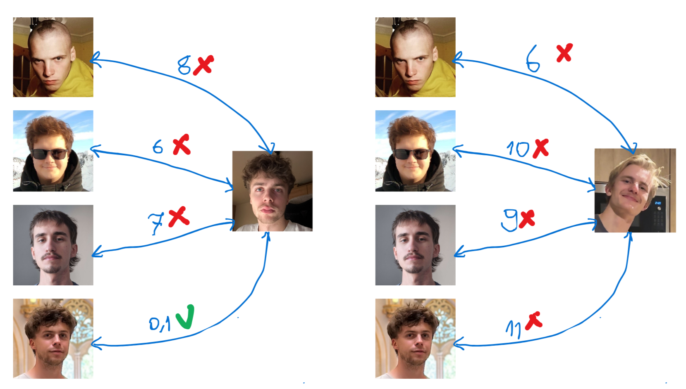
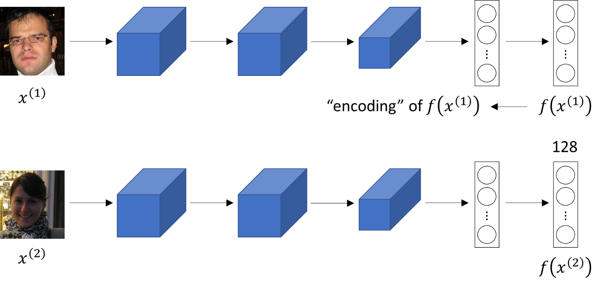
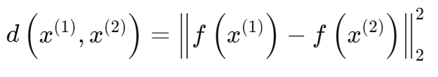
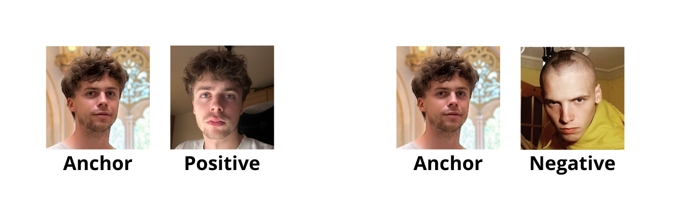
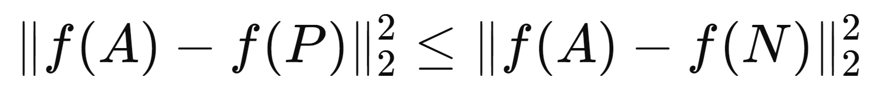
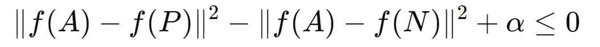
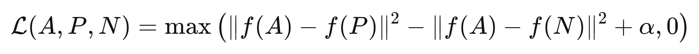
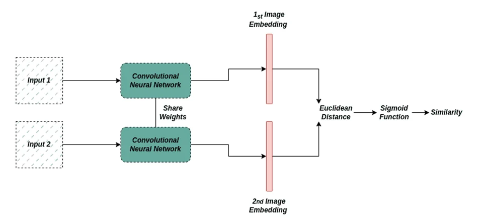
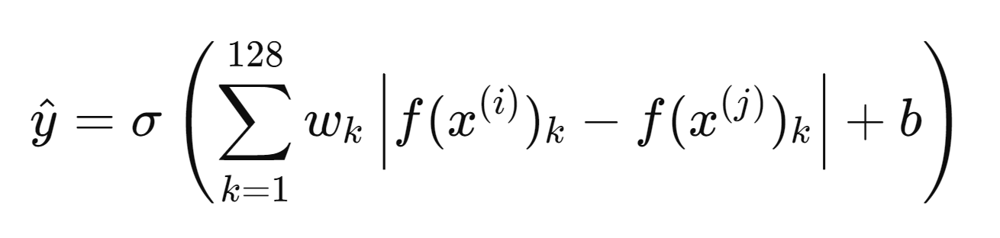

# Face Recognition

## Face Verification vs Face Recognition

#### Face Verification

- Input image, name/ID.
- 1:1 problem - check if the person is who they claim they are.
- Output wherther the input image is that of the claimed person.

#### Face Recognition
- Input image, name/ID.
- Has a database of K persons.
- output ID of the person if the image is any of the K persons ( or "not recognised" ).

## One-shot learning - the basis of Face Verification
- There is only one photo for each person in the database (for example only the photo for ID that employees need to make in order to have a company profile).
- The one-shot learning is learning only from one example (one photo of a person) to verify that it's them.
- One way we could approach the problem is to create a CNN network with 5 outputs (one for each of 4 employees and one for "unknown"), but the main issue is lack of training data to get good results from such CNN. Another problem is what if a new person joins the team? We need to retrain everything and add a new softmax output.
- Instead, it's better to learn a "similarity function" **d(img1, img2)** = degree of difference between images. If the person is simmilair to the one in the picture it should output a small number.
- If **d(img1, img2) <= τ** then same person.
- If **d(img1, img2) > τ** then different person.

  

## Siamese network - why compare the pixels when we can compare learned encoding

- The task of Siamese network is to get the encoding vectors of two input images.
- Then the encoding of both images is used in **d(img1, img2)** simmilarity function.
- The Sister networks share their weights.
- f(x(1)) - encoding of x(1)
- f(x(2)) - encoding of x(2)

  

  

- The fuction calculates the norm of Euclidean distance between two feature vectors.
- Goal of learning:
    - Parameters of CNN + FNN define two encodings f(x(1)) and f(x(2)), 128 dementional encoding vectors.
    - If x(1) and x(2) are the same person, the norm of Euclidean distance between two feature vectors is small.
    - If x(1) and x(2) are different persons, the norm of Euclidean distance between two feature vectors is large.
    - using backpropagation with simmilarity function defined above we vary all parameters to ensure that the conditions are satisfied.

## Triplet loss - an interesting, yet difficult way to teach Siamese network 
- In every iteration we look at 3 images, **Anchor - A**, **Positive - P**, **Negative - N**.

  

- We want the distance between **A** and **P** to be small and the distance between **A** and **N** to be further apart.

  

- The left side of the equation is **d(A, P)** and the right side is **d(A, N)**
- But what if the Neural Network decides to set all weights as **0**? Then the equation is correct every single time.
- Due to this problem we need to make a small adjustment

  

- Now we have the correct Loss function with hyperparameter **α**.
- The nerual network has a very clear task. It needs to decrease **d(A, P)** or increate **d(A, N)** to make the loss the lowest possible.

  

- To ensure that the network is well trained we need to pick the triplets so that P and N are simmilair, but no the same person.
- The objective is to minimize the difference between the d(A, P) and maximize the difference between the d(A, N) pair. By choosing "hard" triplets, where the distance between the anchor and the positive example is close to the distance between the anchor and the negative example, the Neural Network is forced to work harder to push these quantities further apart. 
- This task is hard implementation-wise and dataset-wise as it requires building a comprehensive dataset with hand picked triplets.

## Binary classiciation Face Recognition - the simple and effective way
- We settle with Siamese Network, but we transform the problem into a binary classification

  

- We input the Sister's encoding's outputs of neural network into **Logistic Regression Unit** to make a prediction, where output target is
    - 1 - The same person
    - 0 - Different person
- **Logistic Regression Unit** will be a sigmoid function applied to set of features.

  

- Thanks to this change the dataset is way easier to form, as we just need a pair of images with label 1 - same or 0 - different person.

## Summary 
-  The Siamese Network takes a pair of images as input and computes embeddings for each image. These embeddings are high-dimensional representations that capture the unique features of each image.
- Instead of directly using the embeddings for prediction, we take the absolute difference or other variations of the encodings as features. This difference represents the dissimilarity between the two images in terms of their embeddings.
- The logistic regression unit takes the difference between the embeddings as input and applies a sigmoid activation function to produce a probability output. The sigmoid function maps the input to a value between 0 and 1, representing the probability that the two images belong to the same person.
- During training, the logistic regression unit is optimized to minimize the difference between the predicted output and the true label (one for similar image pairs, zero for dissimilar image pairs). This is done using a binary cross-entropy loss function and backpropagation.
- Inference: During inference, the logistic regression unit takes the difference between the embeddings of a pair of images and predicts whether they belong to the same person or different persons based on the probability output. A threshold can be set to determine the decision boundary for classification.