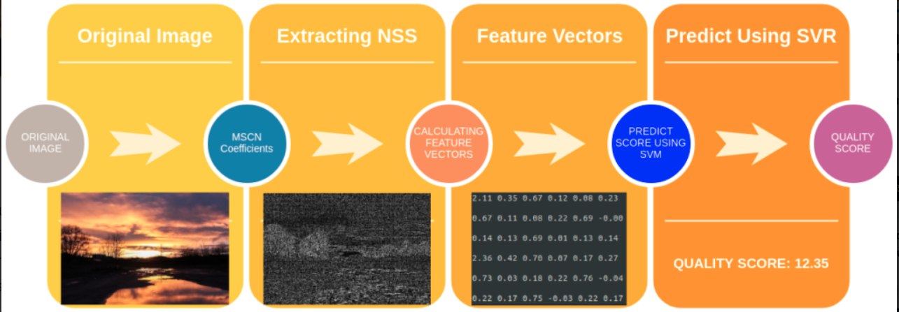
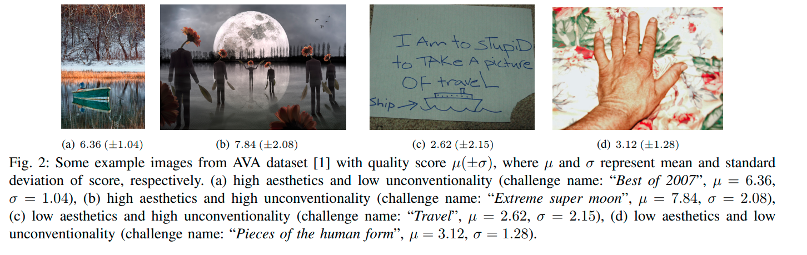
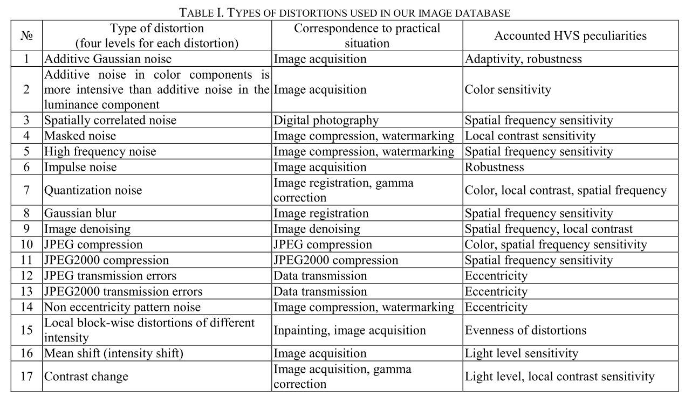

# Objective blind Image Quality Assessment

## BRISQUE - Blind/Referenceless Image Spatial Quality Evaluator

## DIQA - Deep Image Quality Assessment
- characteristics:
  - introduces low-pass filtering to the input image as a normalization
  - uses 9 Conv layers with 3x3 kernels
- 
- [paper](./papers/deep%20cnn-based%20blind%20iqa%20predictor.pdf)

## NIMA - Neural Image Assessment

- characteristics:
  - focuses on aesthetics and technical quality

*Table from A database for evaluation of full reference visual quality assesment metrics*

## Additional Resources
[Introduction to IQA](https://57blocks.io/blog/image-quality-assessment-using-machine-learning)
[DIQUA implementation tutorial](https://towardsdatascience.com/deep-image-quality-assessment-with-tensorflow-2-0-69ed8c32f195)

